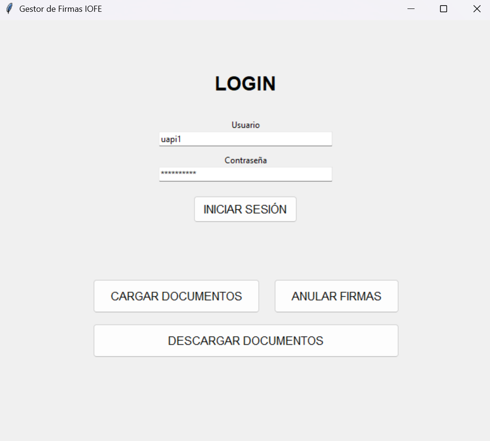
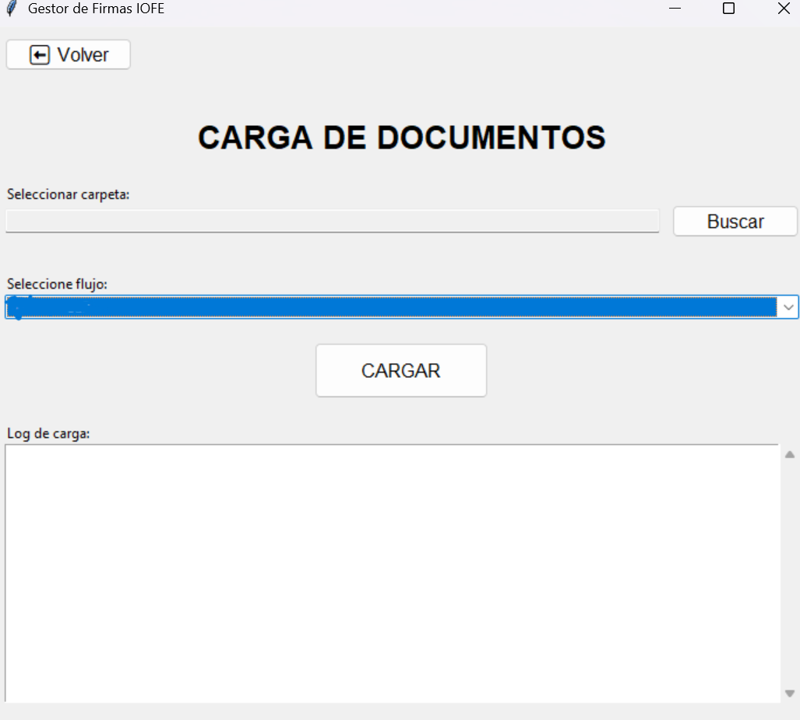

<file name="README.md">
# 🚀 IOFE Mass Manager: Sistema de Automatización de Firmas Digitales


> **Automatización de flujos de trabajo masivos para la gestión de certificados y firmas digitales mediante integración API.**

---

## 📄 Resumen Ejecutivo

Este proyecto es una aplicación de escritorio desarrollada en **Python** diseñada para optimizar y automatizar la gestión del ciclo de vida de documentos en la plataforma de firmas digitales **IOFEsign**.

Nació como una iniciativa proactiva para solucionar un cuello de botella crítico en el departamento de operaciones de **Bureau Veritas (BV)**, transformando un proceso manual y tedioso en un flujo de trabajo automatizado, escalable y accesible para usuarios no técnicos.

---

## 📸 Capturas de Pantalla

| Panel de Login | Carga Masiva |
|:---:|:---:|
|  |  |

---

## 🛑 El Problema (Contexto)

La empresa gestiona la certificación de conversiones vehiculares para concesionarios que envían lotes masivos de expedientes (entre **50 y 100 vehículos por lote**). El proveedor del servicio de firmas digitales (IOFE) entregó una plataforma cuya funcionalidad estándar limitaba la carga de documentos a **uno por uno**.

**Impacto Negativo:**
* **Ineficiencia Operativa:** Subir, firmar y descargar 100 expedientes manualmente consumía horas de trabajo repetitivo.
* **Riesgo de Error:** Dificultad para el seguimiento de qué documentos habían sido cargados o anulados.
* **Dependencia Técnica:** El equipo requería soporte constante para gestionar cargas masivas.

---

## 💡 La Solución

Desarrollé una solución integral que interactúa directamente con la **API REST** del proveedor, permitiendo la gestión masiva (Batch Processing) de tres procesos clave:

1.  **Carga Masiva:** Subida de cientos de PDFs a flujos de trabajo específicos.
2.  **Anulación Masiva:** Cancelación de firmas basada en listados de Excel.
3.  **Descarga Masiva:** Recuperación automática de documentos firmados.

---

## 🛠️ Destacados Técnicos e Integraciones Avanzadas

Esta solución integra servicios en la nube, procesamiento concurrente y bases de datos en tiempo real para crear un ecosistema robusto.

### 🤖 Bot de Sincronización Cloud (Google Sheets Integration)
Implementación de un **bot autónomo** conectado a la API de Google Sheets (`gspread` + `oauth2`) que actúa como una base de datos viva.
* **Funcionamiento:** Cada vez que el sistema carga un expediente a IOFEsign, el bot captura la metadata crítica (Subject/VIN, IOFE ID, Hash, Timestamp) e inyecta una nueva fila en una hoja maestra en la nube.
* **Valor:** Permite trazabilidad del 100% en tiempo real para múltiples usuarios sin necesidad de bases de datos SQL locales.

### 🔄 Orquestación de API RESTful & Seguridad
Diseño de un cliente HTTP robusto para interactuar con la infraestructura de IOFE.
* **Autenticación:** Manejo automatizado de **Tokens JWT (Bearer)** y gestión de sesiones.
* **Payloads Complejos:** Construcción dinámica de peticiones `POST multipart/form-data` para la transmisión eficiente de binarios (PDFs).

### ⚡ Concurrencia y Multihilos (Threading)
Arquitectura no bloqueante para garantizar una experiencia de usuario fluida.
* **Daemon Threads:** Las operaciones de red pesadas se ejecutan en hilos separados del *Main Loop* de la GUI.
* **Resultado:** La interfaz nunca se "congela", permitiendo visualizar logs y barras de progreso en tiempo real mientras el motor trabaja en el backend.

### 📊 Ingeniería de Datos (Pandas Automation)
Uso de `pandas` y `openpyxl` para transformar reportes administrativos en Excel en comandos ejecutables, limpiando datos y validando IDs antes de procesar las transacciones.

---

## 📂 Estructura del Proyecto

```text
IOFE-Mass-Manager/
│
├── assets/                 # Capturas de pantalla y diagramas
│   ├── main.png
│   └── carga.png
│
├── docs/                   # Documentación técnica adicional
│   └── Reporte Tecnico.pdf
│
├── src/                    # Código fuente
│   └── main.py             # Script principal (Sanitizado)
│
├── samples/                # Archivos de ejemplo para pruebas
│   ├── documentos_a_cancelar.xlsx
│   └── google_credentials_dummy.json
│
├── requirements.txt        # Dependencias del proyecto
└── README.md               # Este archivo


