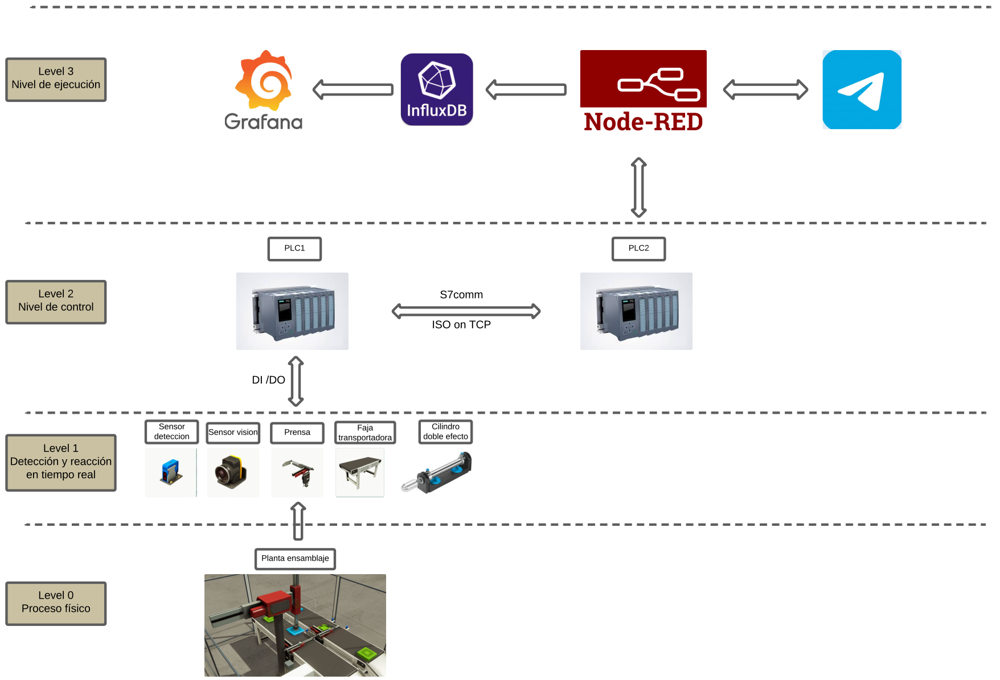
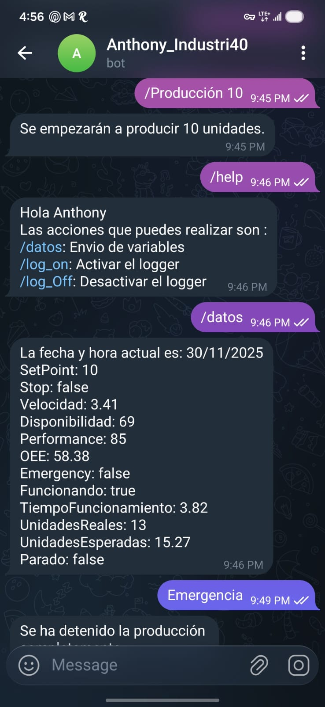

# 🏭 Smart Assembly System: Industry 4.0 Integration
### PLC Control | IIoT | Real-Time Monitoring | Cloud Analytics

## 📖 Descripción del Proyecto
Este proyecto implementa un sistema automatizado de **ensamblaje de dos ejes (Pick & Place)** bajo los principios de la **Industria 4.0**.

El objetivo principal fue integrar el control industrial tradicional (OT) con sistemas de gestión de información (IT), permitiendo no solo la operación automática de la planta, sino también su **monitoreo remoto, cálculo de OEE en tiempo real y control vía mensajería instantánea**.

## 🚀 Características Principales (Key Features)

### 1. Control y Automatización (OT)
* **Lógica de Control Robusta:** Implementada en un **PLC Siemens S7-1500 (CPU 1511C-1 PN)**.
* **Gemelo Digital:** Simulación física de actuadores neumáticos, sensores y bandas transportadoras utilizando **Factory I/O**.
* **Control PID y Secuencial:** Gestión de estados y lazos de control para producción por lotes.

### 2. Digitalización e IIoT (IT)
* **Middleware de Integración:** Uso de **Node-RED** para comunicar el PLC (vía protocolo S7comm/ISO on TCP) con la nube.
* **Base de Datos Temporal:** Almacenamiento de series de tiempo en **InfluxDB** para historiales de producción.
* **Visualización de Datos:** Dashboard en **Grafana** monitoreando KPIs críticos: **OEE, Disponibilidad, Performance, Velocidad y Conteo de Unidades**.

### 3. Operación Remota
* **Telegram Bot:** Control bidireccional. El operador puede enviar comandos (Start/Stop/SetPoint) y recibir alertas de emergencia directamente en su smartphone.

## 🛠️ Arquitectura del Sistema

El sistema sigue una arquitectura piramidal de 4 niveles:

1.  **Nivel 0 (Físico):** Planta de ensamblaje en Factory I/O.
2.  **Nivel 1 (Campo):** Sensores y Actuadores (Entradas/Salidas Digitales).
3.  **Nivel 2 (Control):** PLCs Siemens S7-1500 gestionando la lógica y seguridad (Interlocks).
4.  **Nivel 3 (Supervisión IT):** Node-RED orquestando datos hacia InfluxDB, Grafana y Telegram.

## 📊 Dashboard de Monitoreo (Grafana)

Visualización en tiempo real de la eficiencia de la planta.

## 📱 Interfaz Móvil (Telegram)

Interacción directa con la máquina para gestión de órdenes de producción.

## 🔧 Tecnologías Utilizadas

| Área | Tecnología / Hardware | Uso |
| :--- | :--- | :--- |
| **Control** | Siemens S7-1500 | CPU principal y lógica de automatización |
| **Simulación** | Factory I/O | Virtualización de planta y física |
| **IoT Gateway** | Node-RED | Lectura de tags del PLC y lógica de negocio |
| **Base de Datos** | InfluxDB | Almacenamiento de datos históricos |
| **BI / Analytics** | Grafana | Dashboards de KPIs (OEE) |
| **Mensajería** | Telegram API | Notificaciones y control remoto |
| **Protocolos** | S7comm, TCP/IP | Comunicación industrial |

---
**Autor:** Anthony Valle Quinde
*Ingeniería Mecatrónica - UTEC*