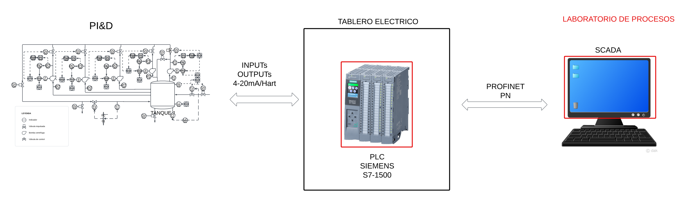
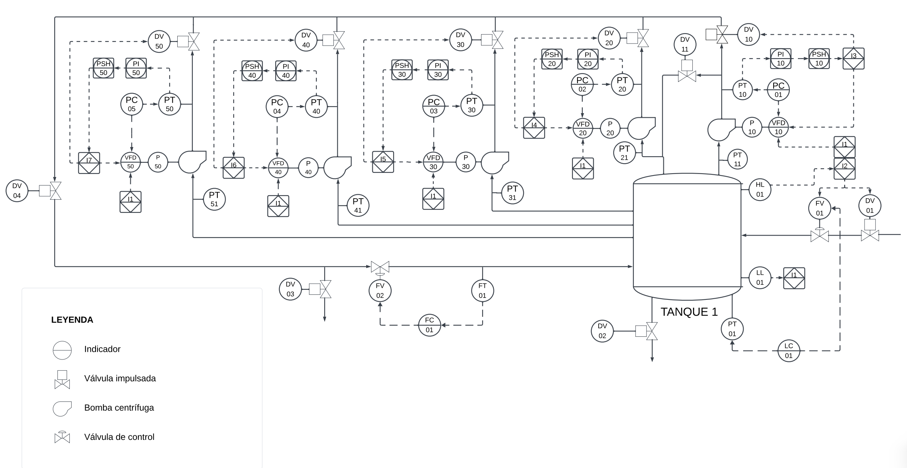
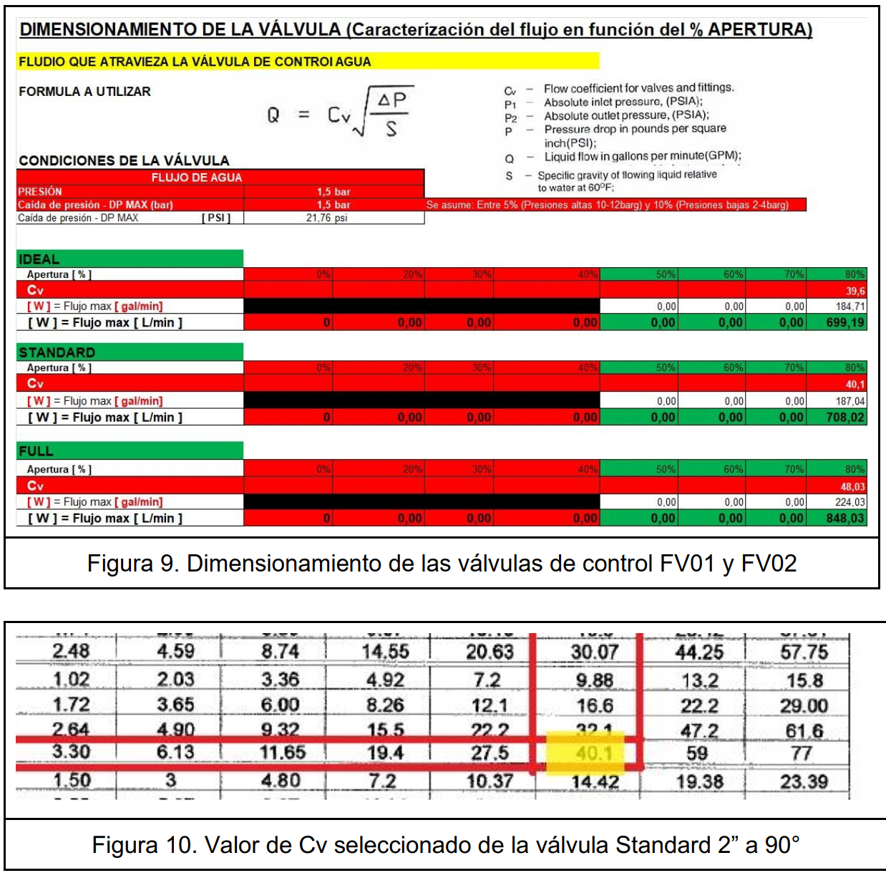

# 🏭 Automatización del Módulo de Bombeo HM-362 (Siemens S7-1500)

## 📖 Descripción del Proyecto

Este proyecto abarca la ingeniería de detalle y diseño de automatización para el módulo **HM-362**, un sistema de comparación de bombas hidráulicas (centrífugas, de émbolo y canal lateral) instalado en la Universidad de Ingeniería y Tecnología (**UTEC**).

El objetivo principal fue diseñar un sistema capaz de controlar el llenado de tanques y la alternancia de bombas en configuraciones serie/paralelo, garantizando la seguridad operativa mediante interlocks y lazos de control precisos.

## 🎯 Objetivos Técnicos

* **Automatización Integral:** Control de llenado de depósito y secuencia de activación de bombas.
* **Ingeniería de Detalle:** Selección y dimensionamiento de instrumentación (sensores de flujo, presión y nivel) y válvulas de control.
* **Diseño de Control:** Implementación de arquitectura centralizada con PLC Siemens S7-1500 y comunicación vía PROFINET y HART.
* **Seguridad:** Diseño de matriz de interlocks y alarmas para protección de equipos y operarios.

## 🛠️ Tecnologías y Hardware Seleccionado

### Controlador (PLC)
* **CPU:** Siemens S7-1511-1PN (Serie S7-1500).
* **Módulos:** Entradas/Salidas Digitales y Analógicas (AI/AO/DI/DO).
* **Protocolo de Campo:** 4-20mA + HART para instrumentación inteligente.

### Instrumentación (Endress+Hauser)
* **Flujo:** Caudalímetro Electromagnético *Promag P 300* (Comunicación HART).
* **Presión:** Transmisores *Cerabar PMC51B* y *PMP51* (Cerámica y Metálica).
* **Válvulas:** Válvulas de control caracterizadas (V-Standard y V-Full) dimensionadas según Cv.

## ⚙️ Arquitectura y P&ID

El sistema se basa en una arquitectura centralizada donde el PLC S7-1500 gestiona todos los lazos de control y se comunica con un sistema SCADA vía PROFINET.

### Diagrama de Tuberías e Instrumentación (P&ID)
Se diseñó el P&ID completo bajo norma ISA, definiendo 7 lazos de control principales.

## 🎛️ Estrategia de Control

El sistema implementa lógica avanzada para el manejo de fluidos:

### Lazos de Control (PID)
| Tag | Variable | Acción | Actuador |
| :--- | :--- | :--- | :--- |
| **FC-01** | Flujo Principal | Control PID Directo | Válvula FV02 |
| **LC-01** | Nivel de Tanque | Control PID Indirecto | Válvula FV01 |
| **PC-01 a 05** | Presión de Descarga | Control PID (Velocidad) | Variadores (VFD) |

### Interlocks (Seguridad)
Se definieron condiciones de bloqueo para proteger el sistema:
1.  **Nivel Bajo (LL01):** Parada de emergencia de todas las bombas para evitar cavitación.
2.  **Sobrepresión (>10 bar):** Apertura de válvulas de alivio y apagado de VFDs específicos.
3.  **Tanque Lleno (HL01):** Cierre automático de válvulas de llenado.

## 📊 Dimensionamiento de Ingeniería

Una parte crítica del proyecto fue el cálculo de ingeniería para la selección de equipos:
* Cálculo de **Cv** para válvulas de control (Caracterización de flujo vs % Apertura).
* Selección de rangos de sensores basados en la presión hidrostática y dinámica del proceso.
* Estimación de carga del PLC (Power Budget y Memory Card).

## 📂 Estructura del Repositorio

* `/Docs`: Memorias descriptivas y hojas de datos.
* `/Design`: Planos P&ID y Arquitectura (PDF/CAD).
* `/Calculations`: Hojas de cálculo de dimensionamiento de válvulas y sensores.
* `/Hardware`: Lista de materiales (BOM) y configuración TIA Selection Tool.

---
**Autor:** Anthony Valle Quinde - Estudiante de Ingeniería Mecatrónica @ UTEC

**Curso:** Instrumentación Industrial
