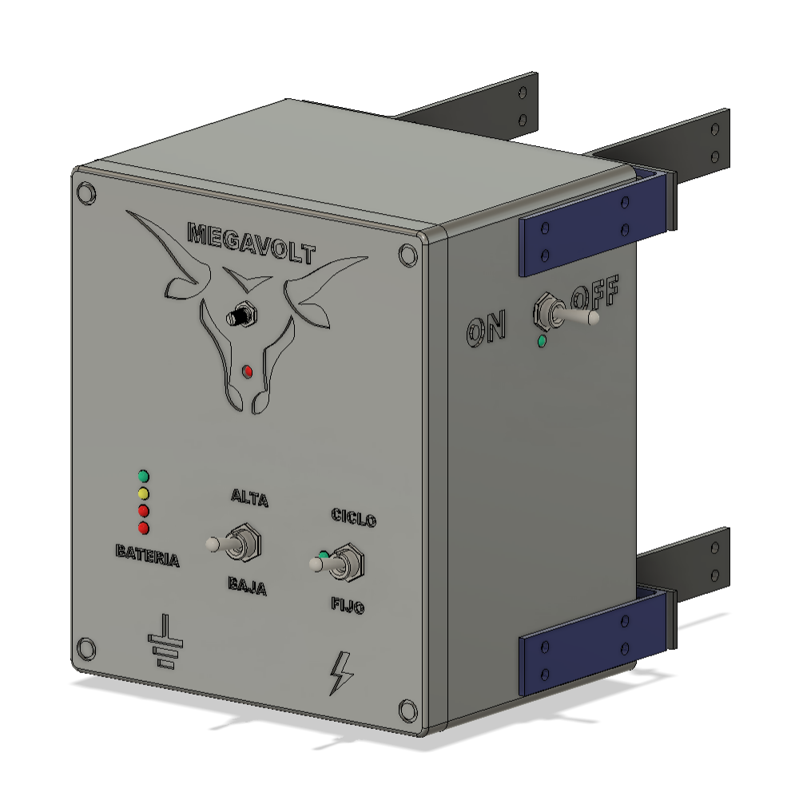
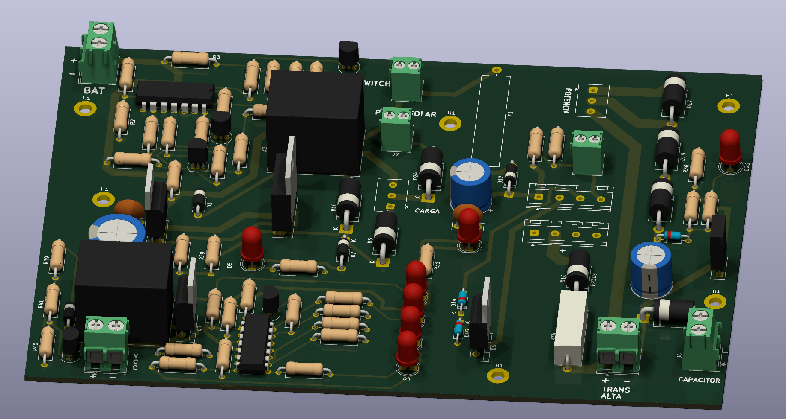

# ⚡ Solar High-Voltage Cattle Energizer (12kV)
### Autonomous Livestock Control System | Power Electronics & Product Design

## 📖 Executive Summary
Development of a **High-Efficiency Hybrid Energizer** designed for livestock management in remote areas. This device represents a complete product engineering cycle, integrating **Solar MPPT charging**, **High-Voltage (HV) Power Electronics**, and **IP65 Mechanical Design**.

The system generates controlled 12kV pulses to maintain perimeter security for cattle, featuring a dual-charging mode (Solar/Grid) to ensure continuous operation under adverse weather conditions.

---

## 📸 Product Gallery

| Enclosure Design (Fusion 360) | PCB 3D View (KiCad) | Field Operation |
| :---: | :---: | :---: |
|  |  |  |

---

## ⚙️ Technical Specifications

| Parameter | Value | Engineering Notes |
| :--- | :--- | :--- |
| **Output Voltage** | 12kV - 14kV (Peak) | High-voltage pulse generation via Triac switching. |
| **Stored Energy** | 2 Joules | Compliant with rural safety standards. |
| **Power Source** | Hybrid | **Solar Panel** (Primary) + **Grid** (Backup/Urban mode). |
| **Battery Management** | 12V 12Ah (SLA) | Integrated BMS with deep discharge protection. |
| **Power Consumption** | 300 mA | Nominal consumption during operation. |
| **Autonomy** | ~1.7 Days | Operation time without solar irradiance. |
| **Protection Rating** | IP65 | Weatherproof enclosure against dust and water jets. |

---

## 🛠️ Engineering & Design Modules

### 1. Electronics & Power Stage (PCB Design)
The core of the system is a custom-designed PCB engineered for high reliability and safety.
* **Topology:** **Boost Converter** configuration to step up 12VDC to ~400VDC, stored in low-ESR Polypropylene capacitors.
* **HV Discharge:** Controlled release via **DB3 Diac** and **Triac** triggering into a custom Step-Up Transformer (Ignition Coil).
* **Smart Charging:** Implemented a dual-mode charging circuit:
    * *Continuous Mode:* For low-radiation zones.
    * *Smart Mode:* Cycle optimization to extend SLA battery life (Charge at 12V -> Cut-off at 14.4V).
* **Safety Design:** PCB layout in **KiCad** features **Isolation Slots** and optimized trace spacing to maximize **Creepage and Clearance**, preventing internal arcing at 12kV.

### 2. Mechanical Design (Product Design)
* **CAD Modeling:** Enclosure designed in **Autodesk Fusion 360**.
* **Features:** Snap-fit joints with silicone gaskets for **IP65 compliance**.
* **Prototyping:** Validated through iterative **FDM 3D Printing** to ensure thermal dissipation and component fit (Transformer/Battery).

---

## 💡 Engineering Challenges & Solutions

| Challenge | Engineering Solution |
| :--- | :--- |
| **Internal Arcing** | Redesigned PCB routing rules to increase **Creepage/Clearance** distances and added physical isolation slots. |
| **Slow Discharge Rate** | Optimized the oscillator circuit and upgraded the step-up transformer capacity for faster pulse frequency. |
| **Battery Degradation** | Developed a firmware logic for **Smart Charging Cycles** (Float/Bulk) to prevent overcharging. |
| **Grid/Solar Hybridity** | Integration of a fast-switching circuit with backflow protection to allow dual power sources. |

---

## 🏭 Manufacturing
* **PCB Fabrication:** Sourced and manufactured via **JLCPCB** (China) ensuring industrial-grade FR4 material.
* **Assembly:** Final assembly and testing conducted in-house.

---

## 🔒 Intellectual Property Notice
> **Commercial Product Notice:**
> This project is currently in the commercialization phase. To protect Intellectual Property (IP), this repository contains **Technical Documentation**, **Architecture Diagrams**, and **Engineering Reports**. Source files (Schematics, Gerber, Firmware) are not publicly available.

### 📄 [Download Full Technical Datasheet (PDF)](./02_Engineering_Docs/Technical_Datasheet_Report.pdf)

---

**Author:** Anthony Valle Quinde

*Mechatronics Engineering | UTEC*
